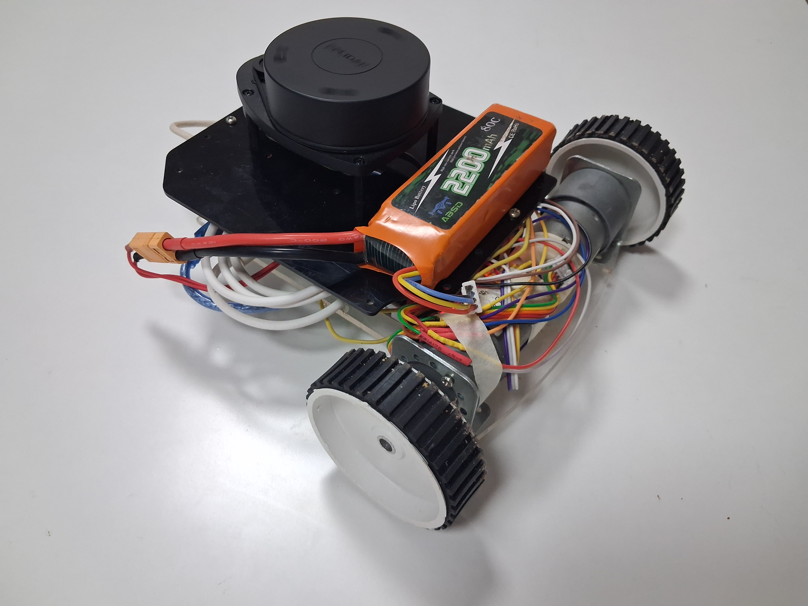

# Mandooka – Autonomous Indoor Navigation Robot

Mandooka is a differential-drive mobile robot built to explore autonomous indoor navigation using ROS 2 Humble. The project was developed with reference to the articubot project by Josh Newans.

The bot includes features such as:

* Teleoperation
* SLAM-based mapping
* Localization
* Autonomous navigation with Nav2

Mandooka has been tested on real hardware (Raspberry Pi 4B as SBC) and in simulation using both Gazebo Classic and Ignition Fortress (simulation support is available in a separate branch).

This project was developed to gain a surface-level understanding of SLAM, Nav2, and to implement and explore various ROS 2 concepts including URDF/xacro, TF2, and lifecycle nodes.

*⚠️ If you're interested in trying it out, please wait while the setup and usage guide is being finalized.*
